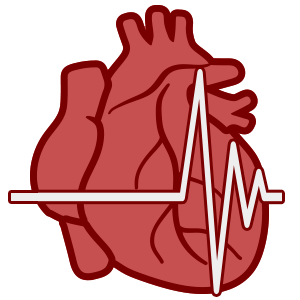

 #   Heart Disease Prediction 
This project will focus on predicting heart disease.      

## Team members
| Team members   | Role |
| ----------- | ----------- |
| Razan Alyahya | |
| Faris Alahmadi | |
| Raghad Alsalamah | |

## What is heart disease?
[Heart disease](https://medlineplus.gov/heartdiseases.html#:~:text=What%20is%20heart%20disease%3F,many%20types%20of%20heart%20disease.) is a general term that includes many types of heart problems. It's also called cardiovascular disease, which means heart and blood vessel disease.

Heart disease is one of the **biggest causes of morbidity and mortality** among the population of the world. 

According to a news article, heart disease proves to be the leading cause of death for both women and men. [The article states the following:](https://midlandtexas.gov/621/Cardiovascular-Diseases#:~:text=Coronary%20heart%20disease%20(CHD)%20is,already%20had%20a%20heart%20attack.)
- Heart disease is the leading cause of death for both men and women. More than half of the deaths due to heart disease in 2009 were in men.
- Coronary Heart Disease(CHD) is the most common type of heart disease, killing over 370,000 people annually.

This makes heart disease a major concern to be dealt with. For that, We have to know the factors that can make us more likely to develop heart disease.

We will be using some common Python libraries, such as **pandas, NumPy, and matplotlib**.

## Dataset:
The dataset is available through the [data world.](https://data.world/informatics-edu/heart-disease-prediction)

This dataset contains patient data concerning heart disease diagnosis that was collected at several locations around the world. There are 270 patients and 14 attributes, including age, sex, resting blood pressure, cholesterol levels, echocardiogram data, exercise habits, and many others.

## Dataset Description:

| Attribute   | Description |
| ----------- | ----------- |
| Age | Age of a patient |
| Sex | Gender of the patient [Male, Female] |
| Chest_pain_type | chest pain type [TA: Typical Angina, ATA: Atypical Angina, NAP: Non-Anginal Pain, ASY: Asymptomatic]|
| Blood_pressure | Blood pressure in Hg (Normal blood pressure - 120/80 Hg) |
| Cholesterol | Serum cholestrol level in blood (Normal cholesterol level below for adults 200mg/dL)|
| Fasting_blood_sugar_over_120 | Fasting Blood Sugar (Normal less than 100mg/dL for non diabetes for diabetes 100-125mg/dL) |
| EKG_results | resting electrocardiogram results [0: Normal, 1: having ST-T wave abnormality (T wave inversions and/or ST elevation or depression of > 0.05 mV), 2: showing probable or definite left ventricular hypertrophy by Estes' criteria]|
| Max_heart_rate_achieved | maximum heart rate achieved [Numeric value between 60 and 202] |
| Exercise_angina | exercise-induced angina [1: Yes, 0: No]|
| ST_depression | ST [Numeric value measured in depression] |
| Slope_of_ST | the slope of the peak exercise ST segment [1: upsloping, 2: flat, 3: downsloping]|
| Number_of_vessels_fluro |  number of major vessels (0-3) colored by flourosopy |
| Thallium | 3 = normal; 6 = fixed defect; 7 = reversable defect|
| Heart_disease | output class [No heart Disease,Heart Disease] |

## Final 
There are many different factors that can make you more likely to develop heart disease. 
| Image   | Description |
| ----------- | ----------- |
|  |  Some factors may affect heart disease risk in men more than women.|
|  |  The risk of heart disease goes up as you get older.|
|  |  |
|  |  |
|  |  |
|  |  |
|  |  |
|  |  |

