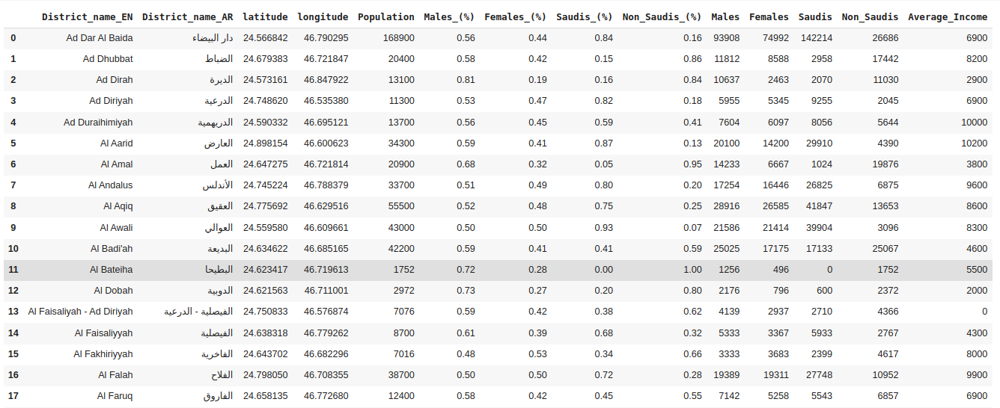
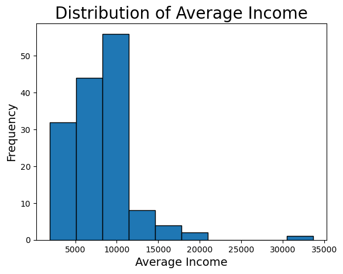
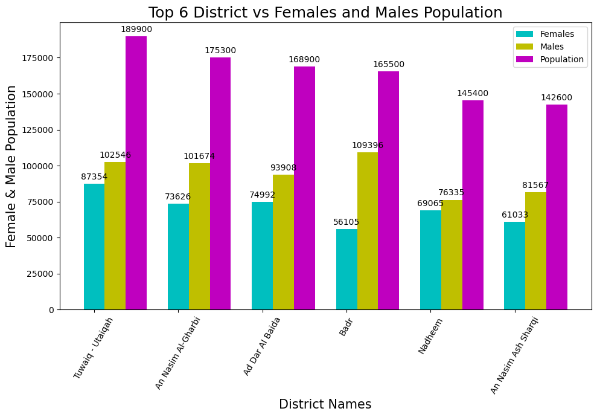

# Project_2 

## Introduction

The project involves gathering information about the neighbourhoods of Riyadh, including information about each neighborhood's geography, demographic statistics, and residents' income levels. \
Knowing the population, the proportion of men and women, as well as the location of the neighbourhood, \
is made simpler by these statistics.

### Overview Dataset

This ***dataset*** includes general information for the neighborhoods of Riyadh, Saudi Arabia. \
It includes the population, the percentage of Saudis and foreigners, and the distribution of males and females. \
In addition to the average income of the residents of these neighborhoods.
Data was collected manually from [Nine Tenths](https://map.910ths.sa/).

## Data elements

Some of the columns were collected manually and others we used little math to find it

**Label**|**Type**|**Source (or columns)**
:-----:|:-----:|:-----
District_name_EN|Text|Manually Translated
District_name_AR|Text|Nine Tenths
latitude|Number (Decimal)|Manually Collected
longitude|Number (Decimal)|Manually Collected
Population|Number|Nine Tenths
Males_(%)|Number (Decimal)|Nine Tenths
Females_(%)|Number (Decimal)|= 1 - [Males (%)]
Saudis_(%)|Number (Decimal)|Nine Tenths
Non_Saudis_(%)|Number (Decimal)|= 1 - [Saudis (%)]
Males|Number|= [Males (%)] * [Population]
Females|Number|= [Population] - [Males]
Saudis|Number|= [Saudis (%)] * [Population]
Non_Saudis|Number|= [Population] - [Saudis]
Average_Income|Number|Nine Tenths

[Dataset](https://github.com/alioh/Saudi-Districts-Dataset)

### Charts

**Histogram Chart :** This is Chart display frequency of Average Income.

**Bar Chart :** A graph showing the statistics of Saudis and non-Saudis, males and females, in six neighborhoods in Riyadh.

###  Team members
| Name     | charts          |
|----------|-----------------|
| Mohammed | Data collection, pre-processing |
| Alaa     | EDA, Pre-processing, Data Profiling|
| Waleed   | histogram , bar |

# Group Members
   The team members' contributions are listed below.

###  Alaa Qadri
- Preprocessing And EDA
- Relation between average Income and population distribution on districts
- Show the population of North Riyadh
- The top 6 Districts vs average income and population distribution
- Top 6 District vs Saudi-Non Saudi Population
- Distribution of Districts On Map
- Distribution Top 6 Districts On Map based on Average Income
- Pandas Profiling

###  Mohammed Alrajeh

- Data collection and pre-processing
- Correlation between the percentage of males and females and the average income
- Correlation between the percentage of Saudis and Non-saudis and the average income
- Heat map of the correlation between the numeric columns
- Bar chart with the number of districts that doesn't start with AL

###  Waleed mohammed almutairi

- histgram chart Distribution of Average Income
- Bar chart Statistics of population ,males and females

